# Homework4 report

### What scenario do I apply in?

>Domain A: Winter landscape Dataset   
>Domain B: Summer landscape Dataset   
>Domain C: Flowers Dataset   

I trained A<->B and B<->C

### What do I modify? 
Download the CycleGAN datasets using the following script
<code>bash ./datasets/download_cyclegan_dataset.sh dataset_name</code>

Here I use "summer2winter_yosemite" and "dslr_flower" datasets   
And Use <code>python train.py --dataroot ./datasets/"The Datasets" --name maps_cyclegan --mode "saved model name" --no_dropout</code> to train new model

I modified some hyperparamers in <code>train_options.py</code> as follows and hope it converge faster:     

<code>   
    
    lambda_A = 15.0
    lambda_B = 15.0
    lr = 0.0003
    lr_decay_iters = 40 
  
</code>

### Qualitative results
| Model name | Real A | Real B | Fake B | Fake A |
| :--------: | :----: | :----: | :----: | :----: |
| A<->B |  |  |  |  |
| A<->B |  |  | 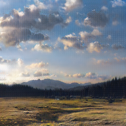 | 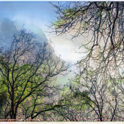 |
| A<->B | 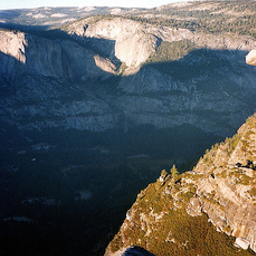 |  | 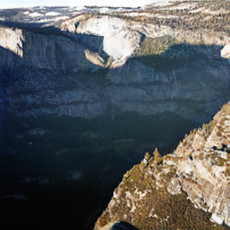 |  |
| A<->B | 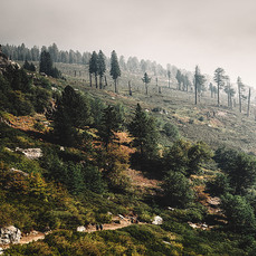 | 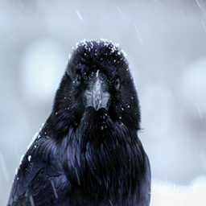 |  |  |
| B<->C |  |  | 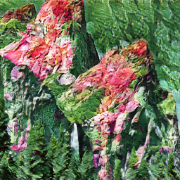 | 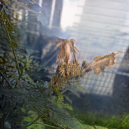 |
| B<->C |  | 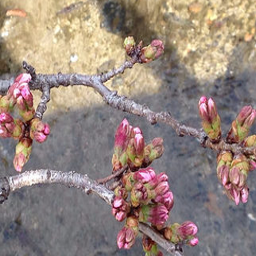 |  | 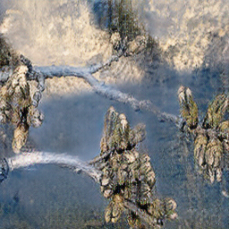 |
| B<->C |  |  | 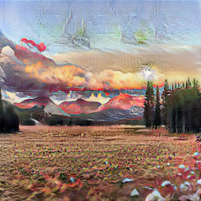 |  |

### My thoughts 
1. The transformation between winter and summer work quite good. When doing A->B, we can see that snow in the mountain melted and grass grows. When it's B->A, we can see some snow landscape appears.

2. The distance between domain B and C are pretty large, so the network can't learn too well.
It sometimes tried to turn whole landscape into multiple flowers instead of plant some flowers in the landscape.
But when it comes to C->B, it still works well to eliminate flowers in Domain C.

### Reference
>junyanz's Pytorch implementation: [here](https://github.com/junyanz/pytorch-CycleGAN-and-pix2pix)   
>junyanz's [project page](https://junyanz.github.io/CycleGAN/)

