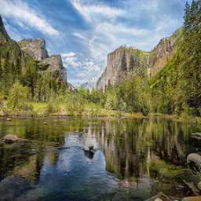
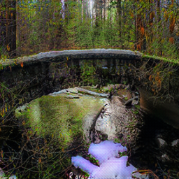
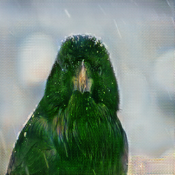

# Homework4 report

### What scenario do I apply in?

>Domain A: women pictures   
>Domain B: body part segmenation  
>Domain C: child pictures    

I trained A<->B and B<->C

### What do I modify? 
you can show some snippet

<code>python train.py --dataroot ./datasets/XXX --name XXX_cyclegan --model cycle_gan</code>

### Qualitative results
| Model name | Real A | Real B | Fake B | Fake A |
| :--------: | :----: | :----: | :----: | :----: |
| A<->B |  |  |  |  |
| A<->B |  |  |  |  |
| A<->B |  |  |  |  |
| A<->B |  |  |  |  |
| B<->C |  |  |  |  |
| B<->C |  |  |  |  |
| B<->C |  |  |  |  |

### My thoughts 
you can make some comments on the your own homework, e.g. what's the strength? what's the limitation?
In the women <-> segmentation transformation, the body segmentation is roughly transformed to the corresponding body (skin, clothes, face). But the image background is noisy and meaningless. I think this is because the images contain only body part segmentaion while no background segmentaion, so learning a structured background is hard for the model.
1. women <-> segmentation
2. child <-> segmentation
  
### Others

### Reference
https://github.com/junyanz/pytorch-CycleGAN-and-pix2pix
