# Homework4 report

### What scenario do I apply in?
I use the built-in data set, horse2zebra, as my first pair of domain transformation. As another pair of domain, I use the same horse dataset plus another giraffe dataset I downloaded online.

### Qualitative results
| Domain | Real A | Fake B | Real B | Fake A |
| :----: | :----: | :----: | :----: | :----: |
| A ←→ B |  |  | 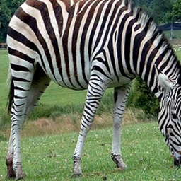 |  |
| A ←→ B |  |  |  |  |
| A ←→ B |  |  |  | 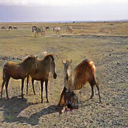 |
| A ←→ B | 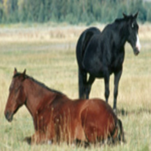 |  |  |  |
| A ←→ B |  |  |  | 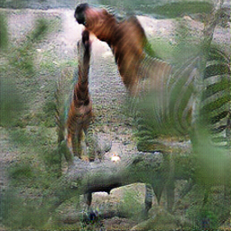 |
| A ←→ B |  | 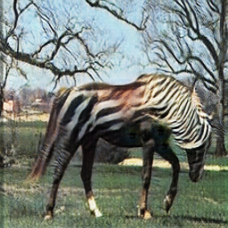 |  |  |
| A ←→ B | 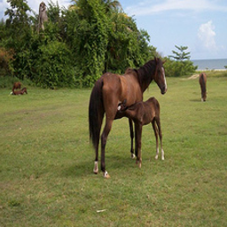 |  |  |  |
| B ←→ C |  | 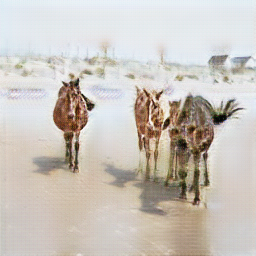 |  |  |
| B ←→ C | 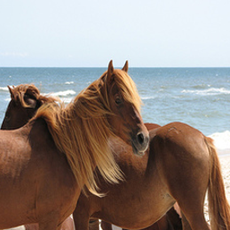 |  | 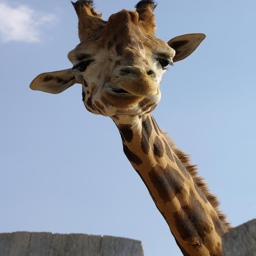 |  |
| B ←→ C |  |  | 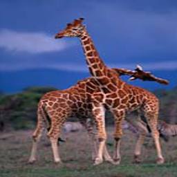 |  |
| B ←→ C |  | 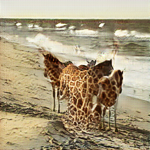 | 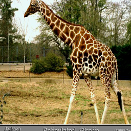 | 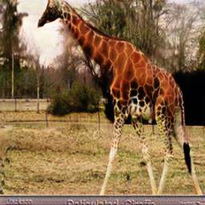 |
| B ←→ C | 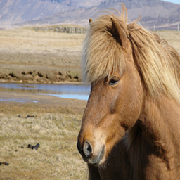 |  |  |  |
| B ←→ C |  |  | 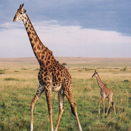 |  |
| B ←→ C |  |  |  |  |
| B ←→ C |  | 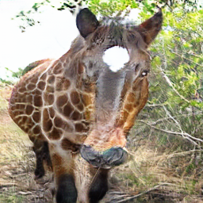 |  | 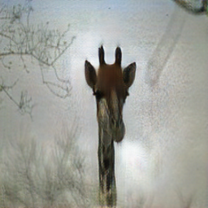 |

### My thoughts
As the results shown, its easier for cycle gan to trainsform domains with weak pattern (horse) into domains with stronger pattern (zebra and giraffe), but not the other way around. It fails to transforms shapes attributes, such as long neck of giraffes. The model tends to generate giraffe without the neck while transforming back to horse, but it can't generate realistic horse with a short neck.

### Others
I uploaded the training files and image results in both horse2zebra_results and horse2giraffe_results directories.

### Reference
https://github.com/junyanz/pytorch-CycleGAN-and-pix2pix
